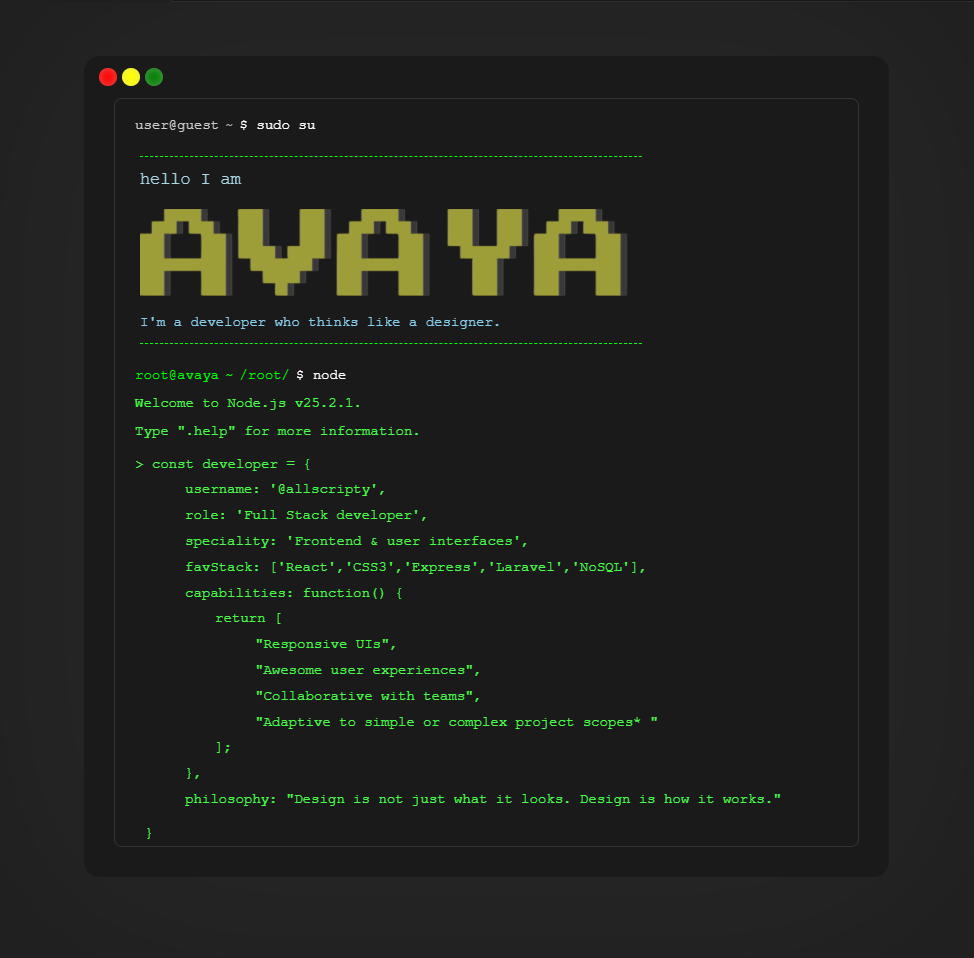

    

        

            

            

        

    

  <!-- sudo su line -->
  

    
user@guest

    
~

    
$ sudo su

  

  <!-- Intro -->
  

    
hello I am

    
    
I'm a developer who thinks like a designer.

  

  <!-- root prompt -->
  

    
root@avaya

    
~

    
/root/

    
$ node

  

  

    
Welcome to Node.js v25.2.1.

    
Type ".help" for more information.

  

  <!-- JS object -->
  

    
&gt; const developer = {

    
username: '@allscripty',

    
role: 'Full Stack developer',

    
speciality: 'Frontend &amp; user interfaces',

    
favStack: ['React','CSS3','Express','Laravel','NoSQL'],

    
capabilities: function() {

    
return [

    
"Responsive UIs",

    
"Awesome user experiences",

    
"Collaborative with teams",

    
"Adaptive to simple or complex project scopes* "

    
];

    
},

    
philosophy: "Design is not just what it looks. Design is how it works."

    
}

  

